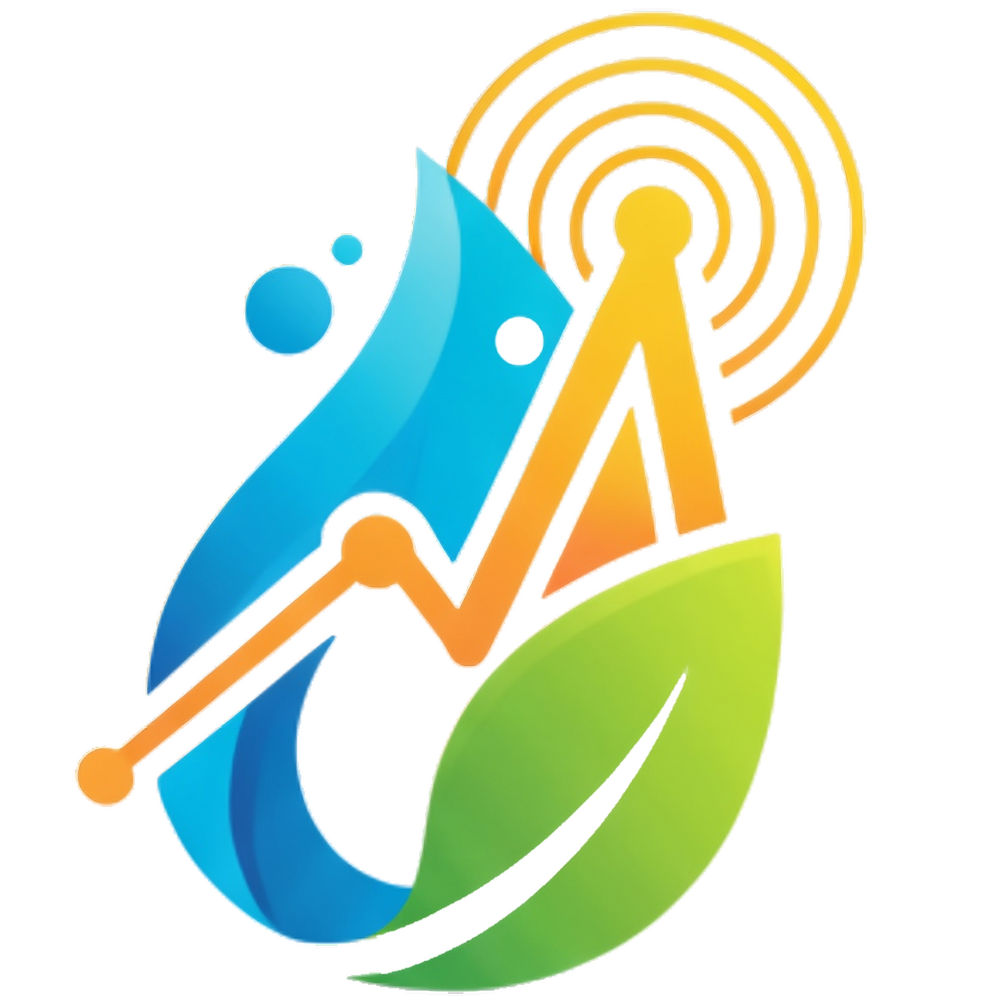
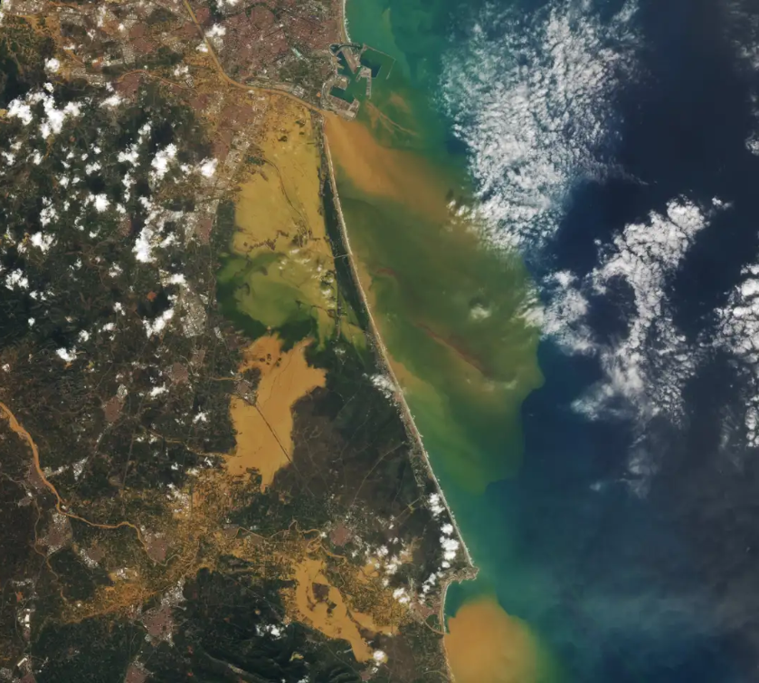
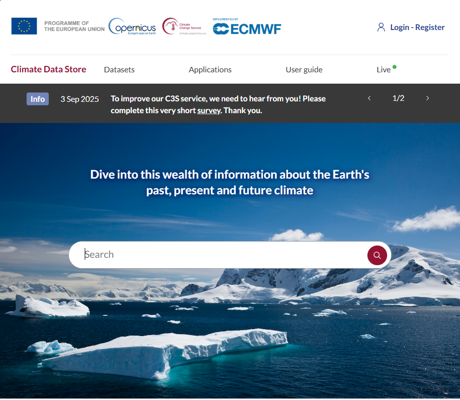
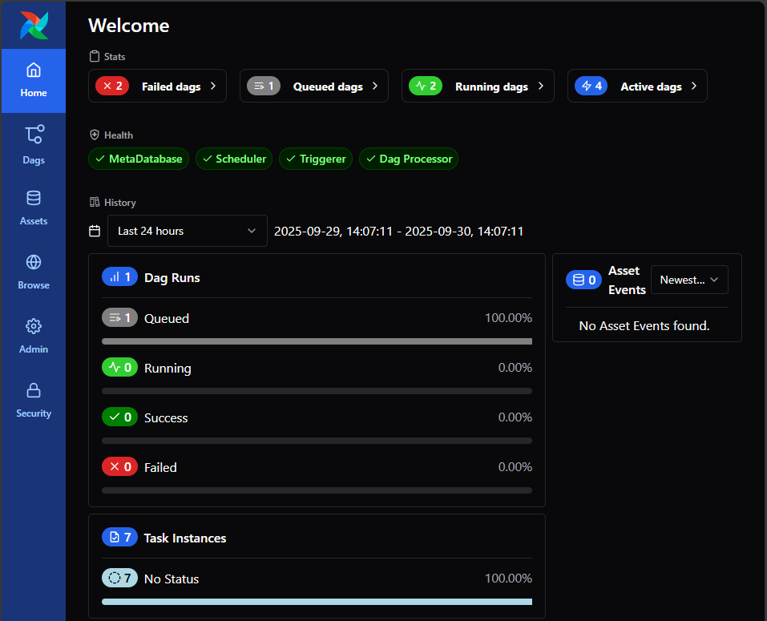
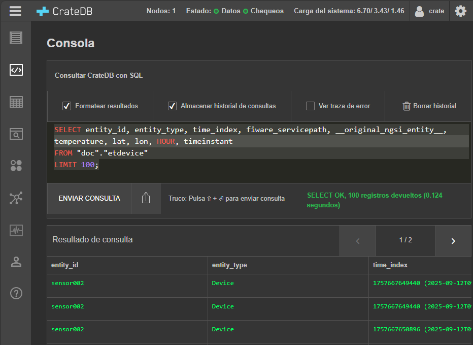

<!-- Improved compatibility of back to top link: See: https://github.com/othneildrew/Best-README-Template/pull/73 -->
<a id="readme-top"></a>
<!--
*** Thanks for checking out the Best-README-Template. If you have a suggestion
*** that would make this better, please fork the repo and create a pull request
*** or simply open an issue with the tag "enhancement".
*** Don't forget to give the project a star!
*** Thanks again! Now go create something AMAZING! :D
-->


<!-- PROJECT SHIELDS -->
<!--
*** I'm using markdown "reference style" links for readability.
*** Reference links are enclosed in brackets [ ] instead of parentheses ( ).
*** See the bottom of this document for the declaration of the reference variables
*** for contributors-url, forks-url, etc. This is an optional, concise syntax you may use.
*** https://www.markdownguide.org/basic-syntax/#reference-style-links
-->
<!--
[![Contributors][contributors-shield]][contributors-url]
[![Forks][forks-shield]][forks-url]
[![Stargazers][stars-shield]][stars-url]
[![Issues][issues-shield]][issues-url]
[![Unlicense License][license-shield]][license-url]
[![LinkedIn][linkedin-shield]][linkedin-url]
-->


<!-- PROJECT LOGO -->
<br />
<div align="center">
  <a href="https://github.com/PGTEC-VRAIN/Entorno-AirFlow_IotAgent_OrionLD_QuantumLeap/blob/main/">
    
  </a>

  <h3 align="center">FIWARE Data environment</h3>

  <p align="center">
    A data platform that periodically retrieves climate and weather historical data and predictions from multiple APIs, standardizes them using Smart Data Models and stores them in a FIWARE Context Broker with historical persistence for machine learning and deep learning models
    <br />
    <a href="https://pgtec.webs.upv.es/"><strong>See the web page »</strong></a>
    <br />
    <!--<br />
    <a href="https://github.com/othneildrew/Best-README-Template">View Demo</a>
    &middot;
    <a href="https://github.com/othneildrew/Best-README-Template/issues/new?labels=bug&template=bug-report---.md">Report Bug</a>
    &middot;
    <a href="https://github.com/othneildrew/Best-README-Template/issues/new?labels=enhancement&template=feature-request---.md">Request Feature</a>-->
  </p>
</div>


<!-- TABLE OF CONTENTS -->
<details>
  <summary>Table of Contents</summary>
  <ol>
    <li>
      <a href="#about-the-project">About The Project</a>
      <ul>
        <li><a href="#built-with">Built With</a></li>
        <li><a href="#tested-on">Tested on</a></li>
      </ul>
    </li>
    <li>
      <a href="#getting-started">Getting Started</a>
      <ul>
        <li><a href="#prerequisites">Prerequisites</a></li>
        <li><a href="#cheatsheet">Cheatsheet</a></li>
      </ul>
    </li>
    <li><a href="#usage">Usage</a></li>
    <!--<li><a href="#roadmap">Roadmap</a></li>-->
    <!--<li><a href="#contributing">Contributing</a></li>-->
    <li><a href="#license">License</a></li>
    <li><a href="#contact">Contact</a></li>
    <li><a href="#references">References</a></li>
  </ol>
</details>

<!-- ABOUT THE PROJECT -->
## About The Project



This repository is part of the tasks of the <a href="https://pgtec.webs.upv.en/">PGTEC</a> project.
Its main objective is to describe and provide the infrastructure required to deploy a data space using <a href="">FIWARE</a> technology, offering a detailed and easy-to-follow guide for different environments.

The project includes the configuration of the infrastructure based on Docker cluster, the installation and configuration of the core FIWARE components (Airflow, IoT Agent, Orion-LD, QuantumLeap), and the integration with external climate and weather data sources to enable standardized data ingestion, real-time context management, and historical storage for predictive analytics.

<p align="right">(<a href="#readme-top">back to top</a>)</p>


### Built With

This section should list any major frameworks/libraries used to bootstrap your project. Leave any add-ons/plugins for the acknowledgements section. Here are a few examples.

<div align="center">

  | <!-- -->                                   | <!-- -->             | <!-- -->            |
  |:-------------------------------------------:|:--------------------:|:-------------------:|
  | [![Python][Python]][Python-url]             | [![Airflow][Airflow]][Airflow-url]   | [![Docker][Docker]][Docker-url] |
  | [![IoT Agent-UL][IoT]][IoT-url]             | [![Orion-LD][Orion]][Orion-url]      | [![QuantumLeap][Quantum]][Quantum-url] |

</div>

<p align="right">(<a href="#readme-top">back to top</a>)</p>

### Tested on

<div align="center">

  | <!-- -->                                  | 
  |:-----------------------------------------:|
  | [![ubuntu22.04.03LTS][ubuntu]][ubuntu-url]  | 
</div>

<!-- GETTING STARTED -->
### Getting Started 


This repository provides a complete environment for IoT data orchestration and management using the following components:

🔹 Main Components

- **Apache Airflow**: Workflow orchestration (DAGs) to automate processes.
- **IoT Agent**: Interface to receive data from IoT devices and forward them to the appropriate context.
- **Orion-LD**: Context management engine based on NGSI-LD.
- **QuantumLeap**: Service for historical storage of events and time-series data for analysis.

🔹 Repository Contents

- **docker-compose.yml** → Configuration of all services and containers.
- **dags/** → Directory containing Airflow DAGs:
  - `AEMET.py` → Retrieves data from the AEMET API and downloads it.
  - `Copernicus.py` → Retrieves Copernicus data for the province of Valencia via the Python CDSAPI.
  - `Flujo_Copernicus_orion.py` → DAG that accesses Copernicus data via API, registers it through the IoT Agent, and stores it in the Orion-LD context broker.
  - `Flujo_copernicus_orion_quantumleap.py` → Improved version of the previous DAG, adding QuantumLeap for historical data storage using CrateDB (recommended DAG to run).


### Prerequisites

This project was developed and tested on:

* Ubuntu 24.04.1 LTS

These are the necessary requirements to be able to execute the project:

|                    Software                              | Version / Nota |
| --------------------------------------------------------:|:------- |
| [Docker](https://docs.docker.com/engine/install/ubuntu/) | 27.2.0 |
| [Docker Compose](https://docs.docker.com/compose/install/) | 27.2.0 |
| [Python](https://www.python.org/) | Docker container  |
| [Airflow](https://airflow.apache.org/) | Docker container  |
| [IoT Agent-UL](https://fiware-tutorials.readthedocs.io/en/latest/iot-agent.html) | Docker container  |
| [Orion-LD Context Broker](https://fiware-orion.readthedocs.io/) | Docker container |
| [QuantumLeap](https://quantumleap.readthedocs.io/) | Docker container / CreateDB backend  |

### Cheatsheet

_The following commands can be used to install some of the necessary software:_

* Docker 
  ```bash
    sudo apt update
    sudo apt install -y apt-transport-https ca-certificates curl software-properties-common

    curl -fsSL https://download.docker.com/linux/ubuntu/gpg | sudo gpg --dearmor -o /usr/share/keyrings/docker-archive-keyring.gpg

    echo "deb [arch=$(dpkg --print-architecture) signed-by=/usr/share/keyrings/docker-archive-keyring.gpg] https://download.docker.com/linux/ubuntu $(lsb_release -cs) stable" | sudo tee /etc/apt/sources.list.d/docker.list > /dev/null

    sudo apt update
    sudo apt install -y docker-ce docker-ce-cli containerd.io
  ```

* Docker Compose
  ```bash
  sudo curl -L "https://github.com/docker/compose/releases/download/v2.20.2/docker-compose-$(uname -s)-$(uname -m)" -o /usr/local/bin/docker-compose
  sudo chmod +x /usr/local/bin/docker-compose
  docker-compose --version
  ```

* Python (Recommended to create an environment from anaconda / miniconda)
  ```bash
    # Download Miniconda installer (Linux x86_64)
    wget https://repo.anaconda.com/miniconda/Miniconda3-latest-Linux-x86_64.sh -O ~/miniconda.sh

    # Run the installer
    bash ~/miniconda.sh

    # Follow the prompts (accept license, choose install path, initialize conda)

    # Initialize conda for bash
    source ~/.bashrc

    # Create a project environment (Python 3.12.3)
    conda create -n pgtec_env python=3.12.3 -y
    conda activate pgtec_env
  ```

<p align="right">(<a href="#readme-top">back to top</a>)</p>


<!-- USAGE EXAMPLES -->
## Usage

This is an example to use the environment using the Copernicus data as an example with the DAG `flujo_coperniocus_orion_quantumleap.py`

Follow the next steps:

1. Get a free Copernicus Climate Data Store API Key at [Copernicus Climate Data Store](https://accounts.ecmwf.int/auth/realms/ecmwf/protocol/openid-connect/auth?client_id=cds&scope=openid%20email&response_type=code&redirect_uri=https%3A%2F%2Fcds.climate.copernicus.eu%2Fapi%2Fauth%2Fcallback%2Fkeycloak&state=Xg5O4h6pHkITloRNwM5IoSGizKWVJdZZWFjve1aYvRA&code_challenge=sQXDzVNLTvWQw-UYP30kS46kCP0d9j06JF2xmBy5KgY&code_challenge_method=S256)



2. Clone the repository
   ```sh
   git clone https://github.com/PGTEC-VRAIN/Entorno-AirFlow_IotAgent_OrionLD_QuantumLeap.git
   ```
3. Run Docker service
   ```sh
   sudo service docker start
   ```
4. Access to the correct repository with the environment `Entorno-AirFlow_IotAgent_OrionLD_QuantumLeap`

  ```bash
  cd Entorno-AirFlow_IotAgent_OrionLD_QuantumLeap
  ```

5. Change API Key at the script `flujo_coperniocus_orion_quantumleap.py`
   ```python
    c = cdsapi.Client(url="https://cds.climate.copernicus.eu/api",
                      key="PUT_YOUR_API_KEY_HERE")
   ```
6. Run the docker compose yaml
   ```bash
   docker compose up --build
   ```

7. Check the status of the containers in a new terminal
   ```bash
   docker ps # see if containers are healthy
   ```

7. Access to airflow to see the DAG running:
    _You may create an account first_

    [Airflow Dashboard](http://localhost:8080)

    

8. Check CreateDB to get historical data
    _You may create an account first_

    [CrateDB Dashboard](http://localhost:4200)

    

<p align="right">(<a href="#readme-top">back to top</a>)</p>
    
9. Shut down the docker 
   ```bash
   docker compose down
   ```
<!-- ROADMAP 
## Roadmap

- [x] Add Changelog
- [x] Add back to top links
- [ ] Add Additional Templates w/ Examples
- [ ] Add "components" document to easily copy & paste sections of the readme
- [ ] Multi-language Support
    - [ ] Chinese
    - [ ] Spanish

See the [open issues](https://github.com/othneildrew/Best-README-Template/issues) for a full list of proposed features (and known issues).

<p align="right">(<a href="#readme-top">back to top</a>)</p>
-->


<!-- CONTRIBUTING 
## Contributing

Contributions are what make the open source community such an amazing place to learn, inspire, and create. Any contributions you make are **greatly appreciated**.

If you have a suggestion that would make this better, please fork the repo and create a pull request. You can also simply open an issue with the tag "enhancement".
Don't forget to give the project a star! Thanks again!

1. Fork the Project
2. Create your Feature Branch (`git checkout -b feature/AmazingFeature`)
3. Commit your Changes (`git commit -m 'Add some AmazingFeature'`)
4. Push to the Branch (`git push origin feature/AmazingFeature`)
5. Open a Pull Request
-->
<!---
### Top contributors:

<a href="https://github.com/othneildrew/Best-README-Template/graphs/contributors">
  
</a>

<p align="right">(<a href="#readme-top">back to top</a>)</p>

-->

<!-- LICENSE -->
## License

Distributed under the AGPL-3.0 License. See `LICENSE` for more information.

<p align="right">(<a href="#readme-top">back to top</a>)</p>


<!-- CONTACT -->
## Contact

Project Link: [https://github.com/PGTEC-VRAIN](https://github.com/PGTEC-VRAIN)

<p align="right">(<a href="#readme-top">back to top</a>)</p>


<!-- References -->
## References

* [Readme Template](https://github.com/othneildrew/Best-README-Template)
* Legacy version: [FIWARE Demo-Setup DSBA-compliant Dataspace](https://github.com/FIWARE-Ops/fiware-gitops/tree/master/aws/dsba)
* Latest version: [FIWARE Data Space Connector](https://github.com/FIWARE/data-space-connector)
* Local deployment: [FIWARE Data Space Connector (Local)](https://github.com/FIWARE/data-space-connector/blob/main/doc/deployment-integration/local-deployment/LOCAL.MD)

<p align="right">(<a href="#readme-top">back to top</a>)</p>


<!-- MARKDOWN LINKS & IMAGES -->
<!-- https://www.markdownguide.org/basic-syntax/#reference-style-links -->
[Python]: https://img.shields.io/badge/python-3.10+-blue.svg?logo=python&logoColor=white
[Python-url]: https://www.python.org/
[Airflow]: https://img.shields.io/badge/airflow-2.x-darkblue.svg?logo=apacheairflow&logoColor=white
[Airflow-url]: https://airflow.apache.org/
[Docker]: https://img.shields.io/badge/docker-20.x-2496ED.svg?logo=docker&logoColor=white
[Docker-url]: https://www.docker.com/
[IoT]: https://img.shields.io/badge/IoT%20Agent--UL-FIWARE-orange.svg?logo=fiware&logoColor=white
[IoT-url]: https://fiware-iotagent-ul.readthedocs.io/en/latest/
[Orion]: https://img.shields.io/badge/Orion--LD-FIWARE-green.svg?logo=fiware&logoColor=white
[Orion-url]: https://fiware-orion.readthedocs.io/en/latest/
[Quantum]: https://img.shields.io/badge/QuantumLeap-FIWARE-purple.svg?logo=fiware&logoColor=white
[Quantum-url]: https://smartsdk.github.io/ngsi-timeseries-api/
[ubuntu]: https://img.shields.io/badge/Ubuntu-E95420?style=for-the-badge&logo=ubuntu&logoColor=white
[ubuntu-url]: https://ubuntu.com/
